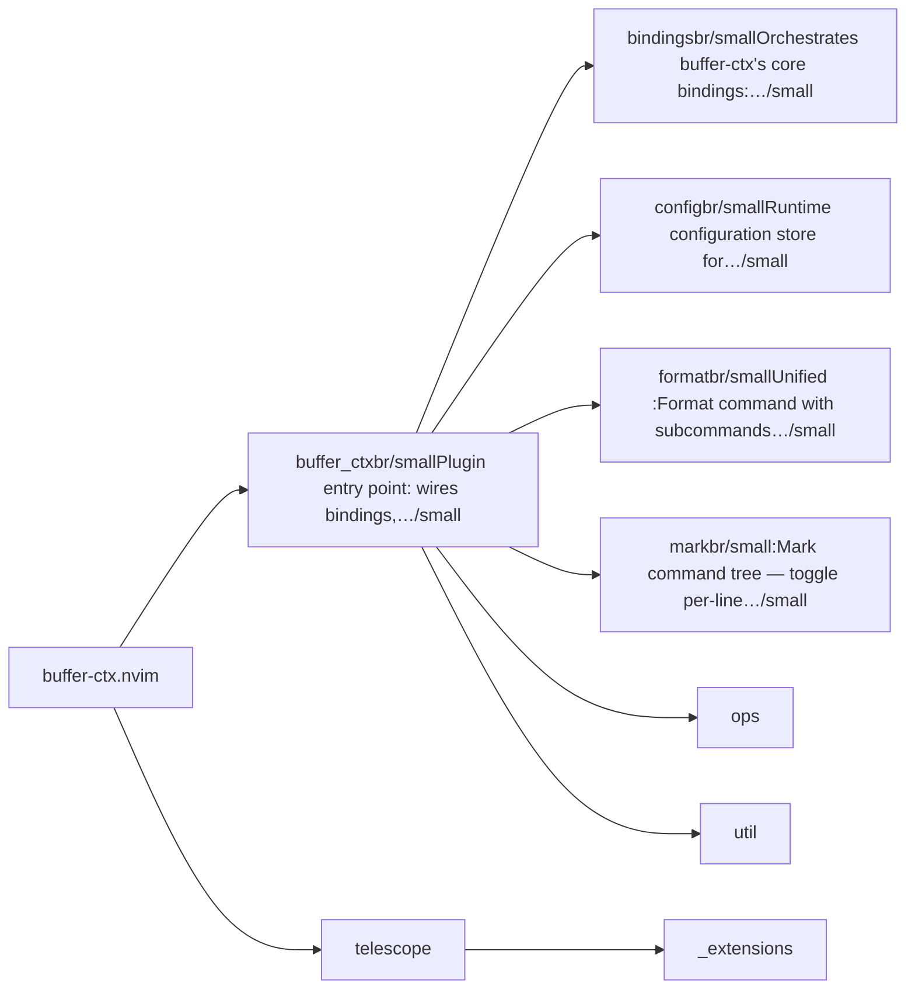
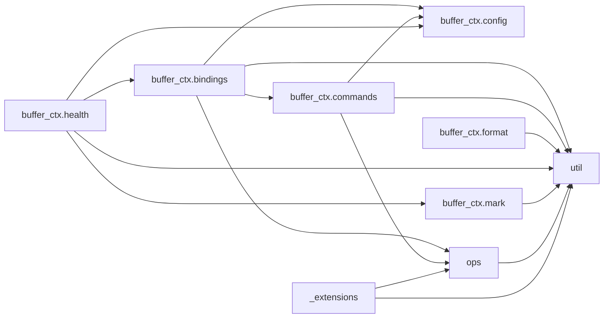

# buffer-ctx.nvim — module map

> **Generated** by `documentation`. Do not edit by hand — run `:DocMap`
> (or `nvim --headless -l scripts/gen_map.lua`) to regenerate.

**9 modules** · 6 namespaces · 37 helper files

The [interactive map](index.html) has filtering, full descriptions and
source links; this page is the version the code host renders directly.

## Namespaces

## Dependencies

Which parts of the tree require which, rolled up to the second level.
The [interactive map](index.html)'s **Deps** view has this per module,
in both directions, with load-time and lazy requires told apart.

## Modules

| Module | Description | Fns | Docs |
|---|---|---|---|
| `buffer_ctx` | Plugin entry point: wires bindings, `:Format` and `:Mark`, and exposes thin `insert`/`copy` wrappers for scripting. | 3 | [src](../../lua/buffer_ctx/init.lua) |
| &nbsp;&nbsp;`buffer_ctx.bindings` | Orchestrates buffer-ctx's core bindings: the `:Insert`/`:Copy` user commands, the 3 base keymaps, and which-key labels. | 1 | [src](../../lua/buffer_ctx/bindings/init.lua) |
| &nbsp;&nbsp;`buffer_ctx.config` | Runtime configuration store for buffer-ctx.nvim. | 2 | [src](../../lua/buffer_ctx/config/init.lua) |
| &nbsp;&nbsp;`buffer_ctx.format` | Unified :Format command with subcommands for buffer-ctx.nvim. | 10 | [src](../../lua/buffer_ctx/format/init.lua) |
| &nbsp;&nbsp;&nbsp;&nbsp;`buffer_ctx.format.types` | Type anchor for the format domain. |  | [src](../../lua/buffer_ctx/format/types/init.lua) |
| &nbsp;&nbsp;`buffer_ctx.mark` | :Mark command tree — toggle per-line marks and yank them to clipboard. | 14 | [src](../../lua/buffer_ctx/mark/init.lua) |
| &nbsp;&nbsp;&nbsp;&nbsp;`buffer_ctx.mark.types` | Type anchor for the mark domain. |  | [src](../../lua/buffer_ctx/mark/types/init.lua) |
| &nbsp;&nbsp;`ops` |  |  |  |
| &nbsp;&nbsp;&nbsp;&nbsp;`buffer_ctx.ops.boilerplate` | Template registry; sub-modules under templates/ are required lazily per key so unused templates are never loaded. | 4 | [src](../../lua/buffer_ctx/ops/boilerplate/init.lua) |
| &nbsp;&nbsp;&nbsp;&nbsp;&nbsp;&nbsp;`templates` |  |  |  |
| &nbsp;&nbsp;&nbsp;&nbsp;`buffer_ctx.ops.types` | Type anchor for the ops domain (including `ops/boilerplate`). |  | [src](../../lua/buffer_ctx/ops/types/init.lua) |
| &nbsp;&nbsp;`util` |  |  |  |
| `telescope` |  |  |  |
| &nbsp;&nbsp;`_extensions` |  |  |  |

## Drift

0 errors · 7 warnings · 20 info

| Severity | Check | Message |
|---|---|---|
| warn | `require-not-declared` | requires "telescope.previewers" (line 21), which no file in this tree declares |
| warn | `require-not-declared` | requires "telescope.pickers" (line 16), which no file in this tree declares |
| warn | `require-not-declared` | requires "telescope" (line 11), which no file in this tree declares |
| warn | `require-not-declared` | requires "telescope.finders" (line 17), which no file in this tree declares |
| warn | `require-not-declared` | requires "telescope.actions" (line 19), which no file in this tree declares |
| warn | `require-not-declared` | requires "telescope.config" (line 18), which no file in this tree declares |
| warn | `require-not-declared` | requires "telescope.actions.state" (line 20), which no file in this tree declares |

20 informational findings

| Check | Message |
|---|---|
| `missing-readme` | lua/buffer_ctx has no README.md |
| `missing-readme` | lua/buffer_ctx/bindings has no README.md |
| `missing-readme` | lua/buffer_ctx/config has no README.md |
| `missing-readme` | lua/buffer_ctx/format has no README.md |
| `missing-readme` | lua/buffer_ctx/format/types has no README.md |
| `missing-readme` | lua/buffer_ctx/mark has no README.md |
| `missing-readme` | lua/buffer_ctx/mark/types has no README.md |
| `missing-readme` | lua/buffer_ctx/ops/boilerplate has no README.md |
| `missing-readme` | lua/buffer_ctx/ops/types has no README.md |
| `unreferenced-module` | buffer_ctx.@types is required by no other file in the tree |
| `unreferenced-module` | buffer_ctx.format.types is required by no other file in the tree |
| `unreferenced-module` | buffer_ctx.health is required by no other file in the tree |
| `unreferenced-module` | buffer_ctx.mark.types is required by no other file in the tree |
| `unreferenced-module` | buffer_ctx.ops.boilerplate.templates.guard is required by no other file in the tree |
| `unreferenced-module` | buffer_ctx.ops.boilerplate.templates.html is required by no other file in the tree |
| `unreferenced-module` | buffer_ctx.ops.boilerplate.templates.lua is required by no other file in the tree |
| `unreferenced-module` | buffer_ctx.ops.boilerplate.templates.markdown is required by no other file in the tree |
| `unreferenced-module` | buffer_ctx.ops.boilerplate.templates.nvim is required by no other file in the tree |
| `unreferenced-module` | buffer_ctx.ops.types is required by no other file in the tree |
| `unreferenced-module` | telescope._extensions.buffer_ctx is required by no other file in the tree |

